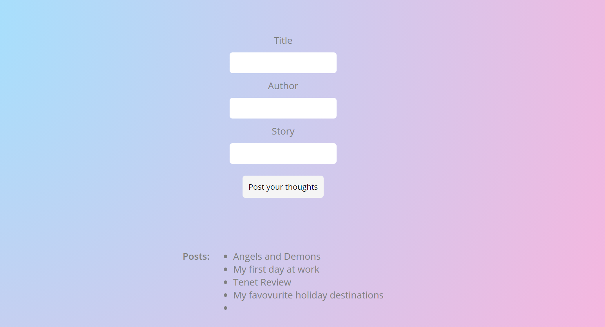

# Blog App

A Vanilla JS App connected to a SQL database that allows users to post and store their blog posts.

## Created by
[Alex](http://github.com/AKP-13) & [Cindy](http://github.com/cindywfeng)

## Instructions
- npm install
- create database called blog
- load the seeds.sql in db folder
- npm start
- open index.html

